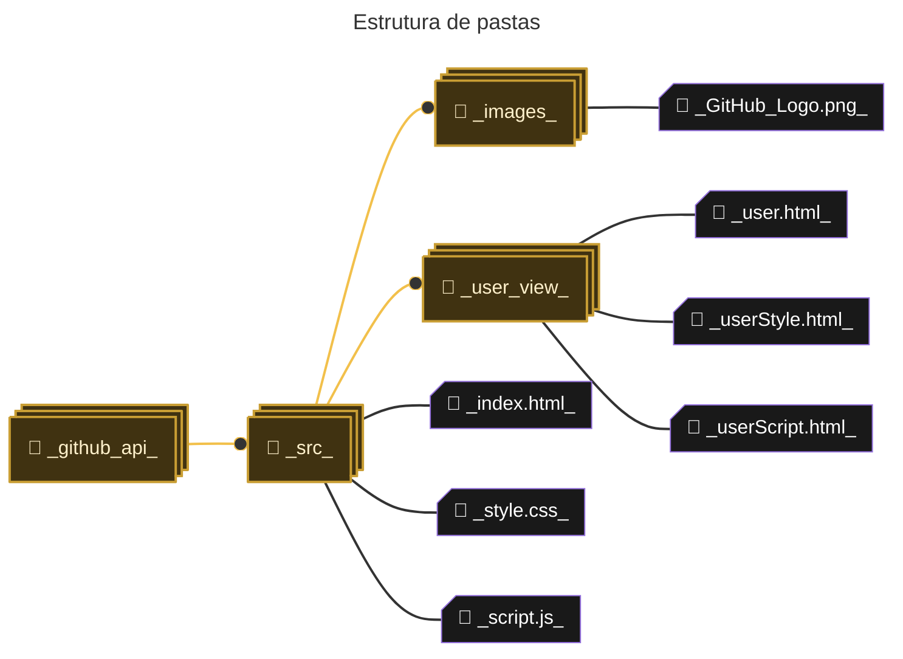

# GitHub API

### licença e tecnologias utilizadas

 <a href="https://learning.postman.com/docs/introduction/overview/"></a>

consumindo a API do GitHub para listar os projetos de um usuário ou organização.  
conteúdo manipulado que a api retorna:

- [x] Nome do repositório
- [x] Descrição
- [x] Quantidade de Stars
- [x] Quantidade de Forks
- [x] Número de commits do repositório
  
<details open="open">
<summary>Tabela de Conteúdos</summary>

- [Instrução de uso](#instrução-de-uso)
  - [GitHub Pages](#github-pages)
  - [Clonando Repositório](#clonando-repositório)
    - [Etapas](#etapas)
  - [Token de acesso](#erro)
- [Endpoints](#endpoints)

</details>

<br>

_sei o básico de front-end, a estrutura de pastas não está muito organizada_


<br>

## Instrução de uso

### GitHub Pages

[clique aqui](https://henrygoncalvess.github.io/github_api/src/) para acessar

<br>

### Clonando Repositório
No Terminal, certifique de que você está na pasta onde vai ficar o repositório

```repositorios\clonados```
``` bash
git clone https://github.com/henrygoncalvess/github_api.git
```

<br>

### Etapas

#### 1. Abra o Visual Studio Code e instale a seguinte extenção:

[Live Server](https://marketplace.visualstudio.com/items?itemName=ritwickdey.LiveServer)  


#### 2. na pasta do repositório clonado  
execute o arquivo "index.html" utilizando o **Live Server**:  


#### 3. na página principal do projeto, digite seu mesmo nome de usuário do GitHub


https://github.com/user-attachments/assets/c06c6020-cfdf-4236-96eb-c6c8b6867dcc

<br>

## <a name="erro">Token de acesso</a>

se você tentou executar a segunda opção [_Clonando Repositório_](#clonando-repositório)  
e mesmo assim não funcionou, pode ser devido a algumas limitações que a API do github possui,  
como por exemplo, **Rate limits**:

"O GitHub limita o número de solicitações de API REST que você pode fazer dentro de um período específico.  
Esse limite ajuda a evitar abusos e ataques de negação de serviço, além de garantir que a API permaneça  
disponível para todos os usuários."

> [!tip]
> Confira a [documentação da API](https://docs.github.com/pt/rest/using-the-rest-api/rate-limits-for-the-rest-api?apiVersion=2022-11-28) para mais informações

Para resolver este problema, você precisará criar e enviar um **Personal access Token** no corpo das requisições.  
Siga os passos abaixo para criar seu Token.

#### 1. Acesse as configurações &nbsp; &nbsp; &nbsp; &nbsp; &nbsp; &nbsp; &nbsp; &nbsp; **2. clique na última opção**


<br>

#### 3. selecione a opção para gerar um token clássico


<br>

**4. digite o nome do token, expecifique que o tempo de expiração  
é de 7 dias e marque apenas a caixa "repo". Após isso, mais abaixo clique em "gerar token"**


<br>

**5. Você verá uma mensagem dizendo para copiar o token e armazená-lo antes de sair,  
pois o código não irá aparecer outra vez, guarde o token em segurança**

**6. dentro dos arquivos "script.js" e "userScript.js", substitua a mensagem de exemplo  
pelo seu novo token de acesso**

`antes`


`depois`


**7. repita isso para "userScript.js" e faça os testes - executando o arquivo "index.html".  
[clique aqui](#etapas) para ver como executar o arquivo**

<br>

## Endpoints

Mesmo com a existência do front-end para vizualizar as respostas das requisições,  
No Postman *ou na linha de comando*, você pode testar os **endpoints**  
abaixo e ver o json por si mesmo.

> [!tip]
> acesse este link, caso não saiba utilizar o Postman para fazer requisições [Postman](https://learning.postman.com/docs/introduction/overview/)  
> acesse este link, caso não saiba fazer requisições pela linha de comando [Clique aqui](https://www.campuscode.com.br/conteudos/comandos-curl-para-testar-requisicoes-api)

Rota | Descrição
--- | :---:
***GET*** ` https://api.github.com/users/OWNER ` | Lista todas as informações do usuário - [ver JSON](#get1)
***GET*** ` https://api.github.com/users/OWNER/repos ` | Lista todas as informações dos repositórios do usuário - [ver JSON](#get2)
***GET*** ` https://api.github.com/repos/OWNER/REPO/commits?per_page=100 ` | Lista todas as informações de commits do usuário - [ver JSON](#get3)

<br>

### <a name="get1">GET - ***Response***</a>

`OBS: mostrando apenas as principais infos`  
`OWNER: octocat`  
`REPO: octocat`  
``` json
{
  "login": "octocat",
  "id": 1,
  "avatar_url": "https://github.com/images/error/octocat_happy.gif",
  "url": "https://api.github.com/users/octocat",
  "followers_url": "https://api.github.com/users/octocat/followers",
  "following_url": "https://api.github.com/users/octocat/following{/other_user}",
  "repos_url": "https://api.github.com/users/octocat/repos",
  "name": "monalisa octocat",
  "public_repos": 2,
  "followers": 20,
  "following": 0,
}
```

<br>

### <a name="get2">GET - ***Response***</a>

`OBS: mostrando apenas as principais infos`  
`OWNER: octocat`  
`REPO: Hello-World`  
``` json
{
  "name": "Hello-World",
  "owner": {
    "login": "octocat",
    "avatar_url": "https://github.com/images/error/octocat_happy.gif",
    "url": "https://api.github.com/users/octocat",
    "repos_url": "https://api.github.com/users/octocat/repos",
  },
  "description": "This your first repo!",
  "commits_url": "https://api.github.com/repos/octocat/Hello-World/commits{/sha}",
  "forks_url": "https://api.github.com/repos/octocat/Hello-World/forks",
  "stargazers_url": "https://api.github.com/repos/octocat/Hello-World/stargazers",
  "forks_count": 9,
  "stargazers_count": 80,
  "watchers_count": 80,
  "default_branch": "master",
}
```

<br>

### <a name="get3">GET - ***Response***</a>

`OBS: mostrando apenas as principais infos`  
`OWNER: octocat`  
`REPO: Hello-World`  
``` json
{
  "url": "https://api.github.com/repos/octocat/Hello-World/commits/6dcb09b5b57875f334f61aebed695e2e4193db5e",
  "sha": "6dcb09b5b57875f334f61aebed695e2e4193db5e",
  "commit": {
    "url": "https://api.github.com/repos/octocat/Hello-World/git/commits/6dcb09b5b57875f334f61aebed695e2e4193db5e",
    "author": {
      "name": "Monalisa Octocat",
      "date": "2011-04-14T16:00:49Z"
    },
    "committer": {
      "name": "Monalisa Octocat",
      "date": "2011-04-14T16:00:49Z"
    },
    "message": "Fix all the bugs",
    "tree": {
      "url": "https://api.github.com/repos/octocat/Hello-World/tree/6dcb09b5b57875f334f61aebed695e2e4193db5e",
      "sha": "6dcb09b5b57875f334f61aebed695e2e4193db5e"
    },
    "comment_count": 0,
    "verification": {
      "verified": false,
      "reason": "unsigned",
      "signature": null,
      "payload": null
    }
  }
}
```
